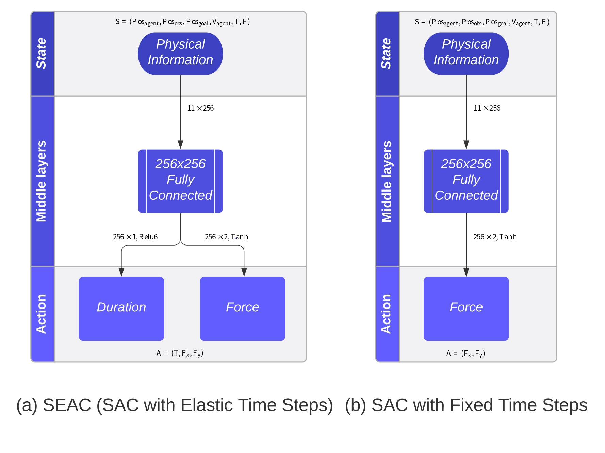
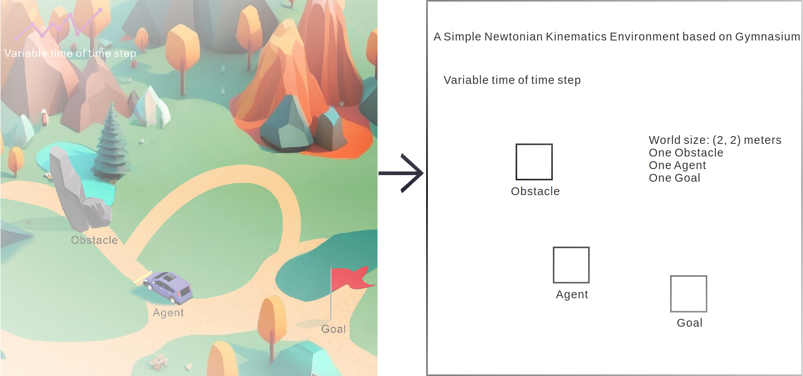
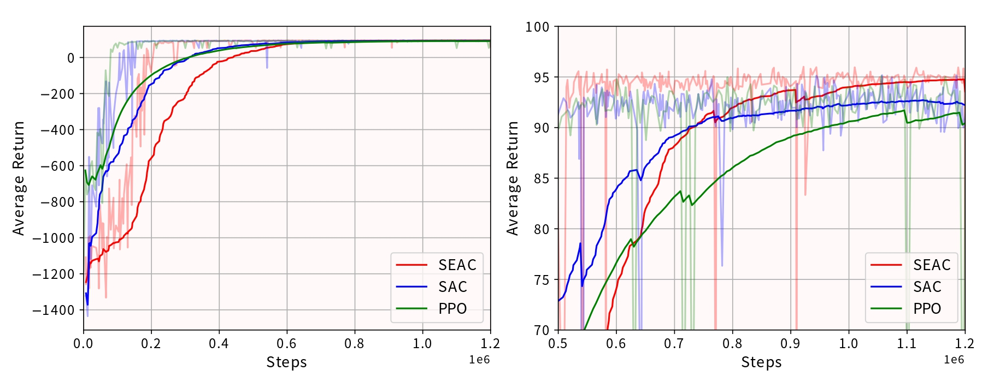
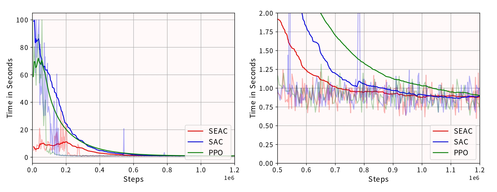
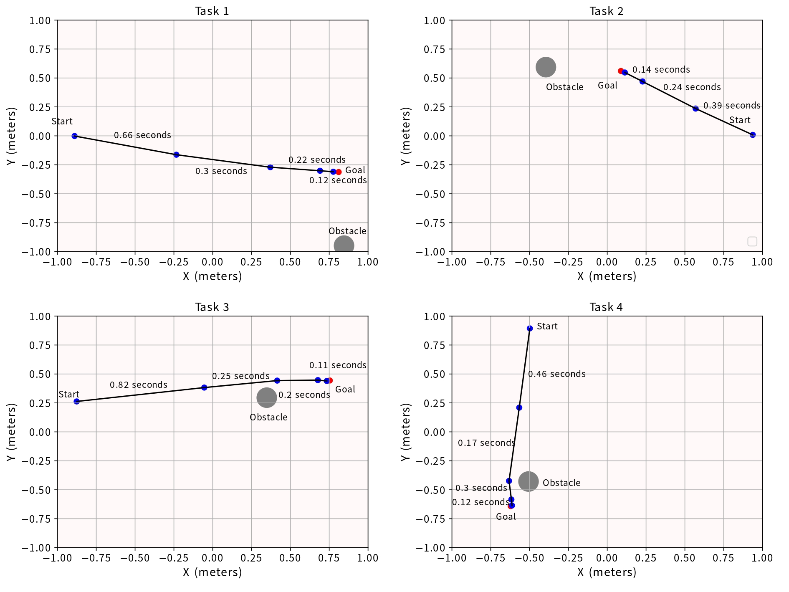
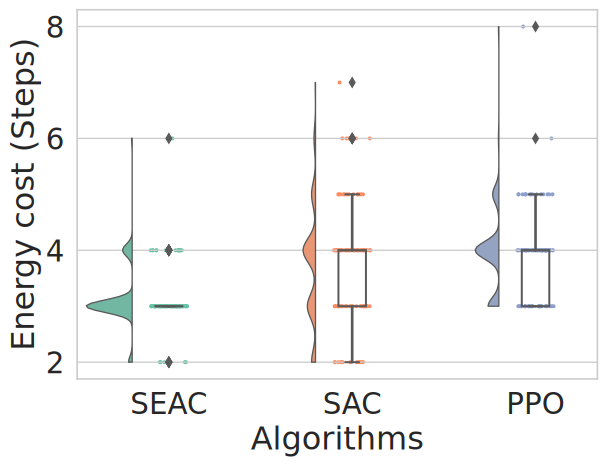

# SEAC_Pytorch_release
The code is for AAAI-DAI 2024 paper: Deployable Reinforcement Learning with 
Variable Control Rate.
<!--After our paper is available online, I'd add the related link here-->

## Model and Test Environment Architecture
We implement our variable control rate method through the SAC algorithm. We called this method Soft Elastic Actor and 
Critic (SEAC). It allows the agent to execute actions with elastic times for every time step.

The core of this algorithm is to follow the principle of reaction control and change the execution time of each action 
of the agent from the classical fixed value of almost all RLs to a more reasonable variable value within a suitable time
range. Since this method reduces the number of data, the compute load would be dramatically decreased. It helps RL 
models to deploy on the weak compute resources platform. The implementation structure of this code is shown in the 
figure below.The implementation structure of this code is shown in the  figure below. For more details, please go to the 
paper.



Our result has been verified within this Newton gymnasium environment (see the figure 
below). For more details about this environment



Following these steps, you can reproduced the result in our paper.

## OS Environment
All commends in this page are based on the Ubuntu 20.04 OS. You may need to adjust some commands to fit other Linux, 
Windows, or Mac OS.
## Remote training with docker
We have already made a docker file for you. What you need to do is to launch it to build your docker image. You are 
welcome to change the path yourself. You can build the docker image by:
```
docker image build [OPTIONS] PATH_TO_DOCKERFILE
```
Then, you can launch it to the dockerhub or somewhere and transform it to your remote PC. And start training.

A [tutorial](https://docs.docker.com/get-started/) on how to use docker.

A [tutorial](https://developer.nvidia.com/nvidia-container-runtime) on how to use cuda with docker.

## Local training with your PC
If you want to train the model locally, and you don't want to speed up the training with local GPU(s), you need to 
install [PyTorch](https://pytorch.org/) first, then you can directly run:
```
cd PATH_TO_YOUR_FOLDER
RUN pip3 install -r requirement.txt
python3 main.py
```

If you want to speed up your training with GPU(s), you need to find out your 
[Nvidia Driver](https://www.nvidia.com/Download/index.aspx?lang=en-us) version and corresponding
[Cuda](https://developer.nvidia.com/cuda-downloads) and [CuDNN](https://developer.nvidia.com/rdp/cudnn-archive) 
versions, then install them first. Next, install the corresponding [PyTorch](https://pytorch.org/) version after all the Nvidia
and PyTorch environments are well setting. Finally, you can run:
```
cd PATH_TO_YOUR_FOLDER
RUN pip3 install -r requirement.txt
python3 main.py
```

Additionally, you can enable (by default) or disable the variable control rate by: 

```
python3 main.py --fix_freq=0 or python3 main.py --fix_freq=1
```
For more parameter settings, please refer to the comments in the code.

We have tested our code on a PC with a Intel 13600K CPU and a NVIDIA RTX 4070 GPU, with the following software versions:

- Cuda: 11.8
- CuDNN: 8.7.0
- Driver: 535.104.05
- Pytorch: 2.0.1+cu118

The results are shown in the following images:

## Average Returns
Average returns for three algorithms trained in 1.2 million steps. The figure on the right is a partially enlarged 
version of the figure on the left.



## Average Time Cost
Average time cost per episode for three algorithms trained in 1.2 millions steps. The figure on the right is a partially
enlarged version of the figure on the left.



## SEAC Model Explanation:
Four example tasks show how SEAC changes the control rate dynamically to adapt to the Newtonian mechanics environment 
and ultimately reasonably complete the goal.



## Energy cost:
The energy cost for 100 trials. SEAC consistently reduces the number of time steps compared with PPO and SAC without 
affecting the overall average reward. Therefore, SAC and PPO are not optimizing for energy consumption and have a much 
larger spread.



More explanation, implementation and parameters related details, please refer to our paper.
<!--After our paper is available online, I'd add the cite information here-->

## License
MIT

## Contact Information
Author: Dong Wang (dong-1.wang@polymtl.ca), Giovanni Beltrame (giovanni.beltrame@polymtl.ca)

And welcome to contact [MISTLAB](https://mistlab.ca) for more fun and practical robotics and AI related projects and 
collaborations. :)


